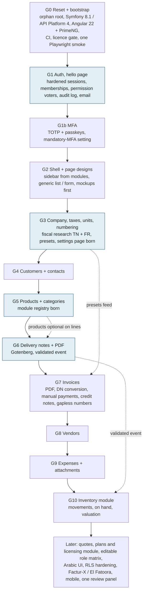
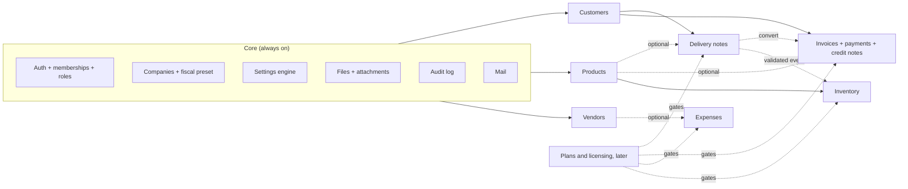
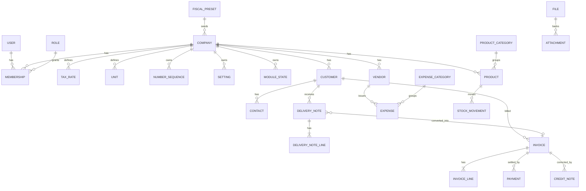

# Archived artefacts, September 2026

Three published pages were deleted. What was only on them is copied here so nothing is lost.

| Original title | Date | Artifact id |
|---|---|---|
| twes-in Reset Map | 2026-09-09 | `Lm3pMnxhiB8sLJyJcwgUs2` |
| twes-in Overnight Report | 2026-09-15 | `HRtvHeomWYWPyPjQBDUvGq` |
| twes-in Quiet Ledger | 2026-09-14 | `4pf5Q7kb48Byt6egqrPuuu` |

**Everything below is historical and superseded.** It is a record of what was proposed or reported on a
given day, not a statement of how twes-in works. Where it disagrees with `docs/SPEC.md`, the spec is right
and this file is wrong; where it names a design direction, that direction was withdrawn on 2026-09-16
(`docs/SPEC.md` § 7). Nothing here is a source to build from. It is kept so that a figure, a token value or
a run id can be found again, and so that a later reader can see what was considered and set aside.

No tracked file and no memory note carries any of the three ids, so their deletion breaks no link in the
repository. One gitignored working note does: `var/claude/morning-report-2026-09-15.md`, the Overnight
Report's own notes, links to the quiet ledger canvas and will point at nothing once it is deleted. That
file is machine-local scratch and is left as it is.

`docs/SPEC.md` refers to the quiet ledger canvas in prose rather than by address, in four places — § 7's
`AGREED` of 2026-09-14 on the design canvas, its `DECIDED (revisit)` entries of 2026-09-15 on figures and on
the settings area, and § 8's G7 paragraph under "Delivered" (lines 609, 615, 616 and 892 as of 2026-09-20).
Those sentences now describe a page that no longer exists, and § 3 below is what they describe.

---

## 1. Reset Map (2026-09-09)

A proposal written on the day of the reset, before any code existed. Its three diagrams are the only ones
ever drawn of the project's shape; `docs/SPEC.md` carries none. They are reproduced as they were, which
means they are reproduced wrong — each is preceded by a line naming what has since changed.

### 1.1 Goal graph

Wrong now in three ways. It names **PrimeNG**, which was refused at G0 on licensing grounds (`CLAUDE.md`
§ "Licensing invariants", invariant 3: the family's "SEE LICENSE IN LICENSE.md" turned out to be an
eligibility-gated commercial licence with a bundled key verifier); Angular Material is used instead. It
counts **eleven goals, G0 to G10**, where `docs/SPEC.md` § 5 now lists **sixteen rows** — G0, G1a, G1b,
G1c, G1d, G2a, G2b, G3a, G3b, then G4 to G10 — and § 8 carries 103 status rows besides. And the
sub-letters **shifted**: here `G1b` is MFA, whereas in the spec `G1b` is companies, memberships and
invitations and MFA is `G1c`. Reading a goal name out of this diagram and looking it up in the spec gives
the wrong goal. The stack row of the same page also named framework versions in prose; per `docs/UPDATE.md`
no version is written in prose, and `make versions` prints what is actually pinned.

The blue class marked the goals in which a mechanism was to be born — the auth template at G1, the settings
page at G3, the module registry at G5, domain events at G6 — so that no engine was built before the feature
needing it. That intent held: `Settings`, `ModuleRegistry` and the event on delivery-note validation all
exist. The goals they were attached to are the ones that moved.

### 1.2 Module dependency map

Wrong now chiefly in what it omits. The core box lists six always-on concerns; `api/src/` holds eleven
contexts beside `Shared` — `Identity`, `Tenancy`, `Audit`, `Inbox`, `Fiscal`, `Settings`, `ModuleRegistry`,
`CustomFields`, `Files`, `ImportExport` and `Licensing` — and most of those are not drawn here. "Plans and
licensing, later" is drawn as a future box; it
is now the `Licensing` context, ruled on 2026-09-17 (`docs/SPEC.md` § 3 "Subscriptions"), holding one
subscription per company whose standing is computed from dates on every request. The seven switchable
modules it draws are, however, exactly the seven under `api/src/Module/`.

### 1.3 Entity relationship model

Wrong now by omission, and the omissions are structural rather than incidental. The diagram has no
`ESTABLISHMENT`, although an establishment is what a document is numbered in and what an invoice and its
delivery notes must share; no `INVITATION` or `SIGNUP`; no custom field definition (`CustomFields`); nothing
for `ImportExport`, for `Inbox` — the notification centre behind the `Notifications` port — for `Audit`, or
for `Licensing`. It does already carry `SETTING`, `MODULE_STATE`, `FILE` and `ATTACHMENT`. The prose beneath
it was right about the things that mattered most and still hold: every business table carries `company_id`,
money is `NUMERIC(14,3)` with the scale taken from the currency, and an issued invoice is immutable and
corrected only by a credit note.

---

## 2. Overnight Report (2026-09-15)

A report of the night of 14 to 15 September. Its decisions were all written into `docs/SPEC.md` § 7 on the
same day and are not repeated here. Two things were only on the page: the CI run ids it watched finish, and
the punch list of what each piece of work left undone.

### 2.1 CI runs

These four ids appear in no file in the repository. They are GitHub Actions run ids on `master`, each
reported green on all four jobs — licences, api, web and e2e.

| Run id | What it covered |
|---|---|
| `34911462158` | Formatting and colour basics: accent fidelity, fr-TN amounts and days, status badges (`23460d7`, `a41bfd6`, `2c67980`, `2b34d2e`) |
| `34914663329` | Company settings moved behind a gear into their own area (`e987255`) |
| `34927411587` | Customer groups and product categories as tabs of Customers and Products (`460def1`) |
| `34928922258` | Notifications in a panel grouped by the company's day (`15b332b`, `450b6a5`) |

The report also lists eight G7 backend commits for the same night: `b6b5e5a`, `5540c5b`, `d7febeb`,
`d72a194`, `ae9bbd4`, `92f1d6e`, `6be5ba5` and `01d2e72`. `docs/SPEC.md` § 8 attributes the first six to run
`34909239598`, which it already records; `6be5ba5` and `01d2e72` are attributed to no run in either source.

### 2.2 Punch list

**The shell these items describe was rebuilt.** Rows 16, 32, 33 and 35 of `docs/SPEC.md` § 8 are all `done`
against the design approved on 2026-09-16, which is a different design: row 16 delivered the restyle basics
(`15b332b`), row 32 the sign-in and settings mockups (`40889e0`), row 33 the shared list and form components
and every page built on them (`1bc8f01`), and row 35 the settings pages and the home page (`3dc70e5`). The
shell is now bottom bar below 600 px, icon rail to 1199 px and a labelled rail above, with a Ctrl K palette.
So most of what follows was either fixed by that rebuild or made moot by it. It is kept because a few items
are observations about behaviour rather than about the old styling, and those may still be true.

Left undone on the sidebar rail: the expanded sidebar measured 360 px, Material's drawer width, where the
canvas drew 240 px.

Left undone on the settings area: the gear did not light up on a settings page; the phone group row did not
scroll to the current entry; two labels were cut at 240 px. The first of these was recorded as deliberate in
`docs/SPEC.md` § 7 (2026-09-15) — the area has no address prefix to match against.

Left undone on the tabs: they stretched across the page, Material's default, where the canvas drew them
left-aligned.

Left undone on the notification panel: no slide-in animation, and the unread dot was covered by unit tests
only, because every entry in the Demo company's inbox had been read. Not built at all, being backend work:
the money and document events — invoice paid, overdue, payment recorded, delivery note delivered — and the
per-type in-app, email or off preferences.

Left undone across the colour work: dark mode and accents other than the default were asserted by unit tests
and never looked at; native date inputs still showed the browser's own placeholder.

Reported as worth the developer's eye in the G7 backend: cancelling a delivery note while a draft invoice is
being written is not locked out, so an issued invoice can carry a cancelled note, which is rare and logged;
and `delivery_note.invoiced` audit rows carry no actor.

Reported as not certified by execution: the row locks under real concurrency, the `FOR UPDATE` paths having
been run single-threaded and never raced; PDF bytes, the tests using a fake renderer; and the listener's
skip path against live PostgreSQL commit ordering. Playwright was not run on the machine — Chromium was not
installed — so CI ran it.

Raised as needing the developer, and still open at the time: whether a Tunisian credit note carries the
stamp duty. `docs/fiscal/TN.md` § 4 does not source it, and a copied stamp is charged back unless the draft
removes it.

The five questions the canvas asked, numbered as its boards numbered them: (1) outlined fields with the
label above, instead of Material's filled ones; (2) warm neutrals at hue 75 instead of neutrals tinted by
the accent; (3) which four figures the customer highlights show; (4) the home page's three figures and its
to-do groups; (5) a floating save bar in settings instead of a button at the end of each form. Question 2 is
the one `docs/SPEC.md` § 7 still refers to, in its `DECIDED (revisit)` entry of 2026-09-15 on figures.

---

## 3. Quiet Ledger (2026-09-14)

A design canvas: eight artboards — `Main`, `Editor`, `Home`, `Customer`, `Notifications`, `Settings`,
`Phone` and `Tokens` — drawing a calm, number-led visual language. The direction was **withdrawn on
2026-09-16** (`docs/SPEC.md` § 7): after testing the running application the developer judged it dated
rather than calm, and asked instead for a look that is simple and easy to use yet clean, modern, vivid and
durable. Three contrasting directions were then drawn — A Prisme, B Relief, C Registre — C was rejected, and
a final design between A and B was approved on the same day, on the Look canvas at
`https://claude.ai/artifact/5N1tDVLyZXCBoGKJCU6wQd`, page "Design final". That approved design, not this
one, is what rows 16, 32, 33 and 35 built.

What follows is kept for three reasons: the token values were computed rather than invented and are worth
being able to compare against; the dataset is internally consistent and makes a good fixture to reason
about; and the totals order it draws is the one the calculator actually implements, so the board is a
correct worked example of Tunisian invoicing even though its styling is dead.

### 3.1 Design tokens

The `Tokens` board states its own derivation: colours computed from the accent `#1f6feb` with
`SchemeFidelity`, so the chosen colour stays vivid, over warm neutrals at hue 75 and chroma 3 and 6, by
`@material/material-color-utilities` 0.3.0. Light on the left, dark on the right. Figures in Inter, tabular
and slashed-zero.

| Role | Token | Light | Dark |
|---|---|---|---|
| Primary | `--mat-sys-primary` | `#0057c3` | `#afc6ff` |
| On primary | `--mat-sys-on-primary` | `#ffffff` | `#002d6d` |
| Primary container (the chosen accent) | `--mat-sys-primary-container` | `#1f6feb` | `#1f6feb` |
| Background | `--mat-sys-surface` | `#fff8f4` | `#16130f` |
| Card | `--mat-sys-surface-container-lowest` | `#ffffff` | `#100e0a` |
| Sidebar, headers | `--mat-sys-surface-container-low` | `#faf2ec` | `#1e1b17` |
| Separator | `--mat-sys-surface-container` | `#f5ece6` | `#221f1b` |
| Border | `--mat-sys-surface-container-high` | `#efe7e1` | `#2d2925` |
| Text | `--mat-sys-on-surface` | `#1e1b17` | `#e9e1db` |
| Secondary text | `--mat-sys-on-surface-variant` | `#4d463d` | `#d0c5b9` |
| Tertiary text | `--mat-sys-outline` | `#7f766b` | `#998f84` |
| Field outline | `--mat-sys-outline-variant` | `#d0c5b9` | `#4d463d` |
| Error | `--mat-sys-error` | `#ba1a1a` | `#ffb4ab` |

The accent is the same hex in both schemes, which is the whole point of `SchemeFidelity`: the colour a
company picks is rendered as picked. That ruling survived the withdrawal — `docs/SPEC.md` § 7 records it on
2026-09-14 and it is still how the runtime theme is built.

**Status pills.** A 6 px dot on a soft pill, label at 12/16 and weight 500, height 22, background at tone 94
with reduced chroma and text at tone 30. The board states the rule that matters: colour never carries the
meaning alone, the label is always written.

| Status | Background | Text | Dot |
|---|---|---|---|
| Invoice — Brouillon | `#f6ece4` | `#4b4640` | `#7d766f` |
| Invoice — Émise | `#e9edff` | `#004299` | `#2471ed` |
| Invoice — Partiellement payée | `#ffead7` | `#653e00` | `#a66a0b` |
| Invoice — Payée | `#ddf4d9` | `#135224` | `#488450` |
| Invoice — En retard | `#ffe9e6` | `#87201b` | `#c85045` |
| Invoice — Annulée | `#f6ece4` | `#4b4640` | `#7d766f` |
| Delivery note — Brouillon | `#f6ece4` | `#4b4640` | `#7d766f` |
| Delivery note — Validé | `#e9edff` | `#004299` | `#2471ed` |
| Delivery note — Livré | `#ddf4d9` | `#135224` | `#488450` |
| Delivery note — Facturé | `#f6ece4` | `#4b4640` | `#7d766f` |
| Delivery note — Annulé | `#f6ece4` | `#4b4640` | `#7d766f` |
| Credit note — Brouillon | `#f6ece4` | `#4b4640` | `#7d766f` |
| Credit note — Émis | `#e9edff` | `#004299` | `#2471ed` |
| Credit note — Annulé | `#f6ece4` | `#4b4640` | `#7d766f` |

In dark, five tones were drawn:

| Status | Background | Text | Dot |
|---|---|---|---|
| Brouillon | `#39342e` | `#e5dbd3` | `#b2aaa2` |
| Émise | `#2c3449` | `#d1dcff` | `#84aaff` |
| Partielle | `#453117` | `#ffd6a8` | `#e39d41` |
| Payée | `#263927` | `#acecaf` | `#7bba81` |
| En retard | `#4b2d29` | `#ffd3cd` | `#ff897d` |

Two divergences from what was built are worth naming, since a later reader comparing the two will meet them.
The canvas named the accent-following tone `blue`; the implementation named it `accent`, because it is red
under a red accent (`docs/SPEC.md` § 7, the 2026-09-15 `DECIDED (revisit)` on figures). And the canvas gave
a delivery note **Livré** the green tone
and **Facturé** the neutral one, whereas the implementation made delivered amber — it is still waiting to be
invoiced — and invoiced green.

**Typography.** Page title 24/32 at 600; section title 16/24 at 600; body 14/20 at 400; label 12/16 at 500;
principal amount 28/36 at 600; amount in a table 14/20 at 500.

**fr-TN formats.** TND amounts at three decimals, `2 975,000 TND`; EUR at two, `1 234,50 €`; a negative as
`−28,482`; a date as `14/09/2026`; lateness as `en retard de 5 jours`; relative time as `il y a 12 min` and
`hier à 16:20`.

**Buttons.** Height 36, or 32 inside a table; radius 8; 14/20 at 500. One primary action per screen.

**Fields.** Proposed: label above, outlined, 40 px. Current at the time: Material's filled field at 56 px.
This is canvas question 1 of the Overnight Report.

**Sidebar.** Three states: expanded on a desktop, icons on a desktop with the `[` key, a drawer on a phone.

### 3.2 The Tunisian totals order

The `Editor` board draws an invoice draft for Sfax Métal SARL and states the totals in this order, both in
the editor's totals panel and in the PDF preview beside it:

| Line | Amount |
|---|---|
| Total HT | `2 376,000` |
| FODEC 1 % | `17,460` |
| TVA 19 % *sur 2 393,460* | `454,757` |
| Droit de timbre | `1,000` |
| **Total TTC** | `2 849,217` |
| Retenue à la source 1 % | `−28,482` |
| **Net à payer** | `2 820,735` |

**This order is the one the calculator implements.** The figures are not decorative; they encode two rules,
and both are the repository's rules.

FODEC enters the VAT base. The lines total `2 376,000`; FODEC of `17,460` is 1 % of `1 746,000`, the first
line alone, because only that line carries FODEC — a reader recomputing 1 % of the whole `2 376,000` will
get `23,760` and wrongly think the board is broken. VAT is then charged on `2 376,000 + 17,460 =
2 393,460`, which the board writes out, and 19 % of that is `454,757`. `docs/fiscal/TN.md` § 3 records
`enters_vat_base: true` for FODEC against the Code de la TVA art. 6-I, and `docs/SPEC.md` § 3 carries the
same flag in the closed tax-kind set.

The stamp duty is outside the withholding base. The stamp of `1,000` is added after VAT to give a total TTC
of `2 849,217`. The withholding is `28,482`, which is 1 % of `2 848,217` — the total *without* the stamp —
and not `28,492`, which is what 1 % of the total TTC would give. `docs/fiscal/TN.md` § 5 states the rule as
"base = total of lines and percentage taxes, fixed charges excluded", noting that no source was found for
the stamp's treatment and that this is the preset's own choice.
`api/src/Fiscal/Domain/Calculation/DocumentCalculator.php` implements exactly that: it forms `$beforeCharges`
from the net after discount plus the percentage taxes, adds the fixed document charges to reach the total,
and then computes each withholding against `$beforeCharges`, subtracting the result to give the amount due.
The 1 000 TND threshold applies and is met.

The board's other fiscal details agree too: the customer is on the régime normal with a matricule fiscal,
paying at 30 days, and carries TVA 19 %, FODEC 1 % and retenue à la source 1 %, which is the set
`docs/fiscal/TN.md` describes.

### 3.3 The dataset

Invented, but consistent throughout the eight boards, which is what makes it useful: a change in one figure
shows up in the others. The company is **Atelier Carthage SARL**, 12 rue de Marseille, 1000 Tunis, MF
7654321/B/A/M/000, RC B0123452026, establishment *Siège, Tunis (000)*, signed in as **Salma Ben Ali**. The
day is Monday 14 September 2026.

The invoice list holds **48 invoices**: 3 drafts, 17 to collect, 4 overdue, 27 paid, 1 cancelled. The filter
shown — issued in 2026, unsettled — totals **33 684,853 TND** charged and **31 834,853 TND** still due
across its 17 invoices.

The home page splits that outstanding figure into **26 699,223** not yet due and **5 135,630** overdue,
which add back to 31 834,853 exactly. The four overdue invoices are FA-2026-00026 (Pharmacie Ibn Sina,
`1 003,330`, 24 days late), FA-2026-00027 (Médina Import, `1 500,000` still due of `2 150,000`, 18 days),
FA-2026-00029 (Librairie Al Kitab, `742,300`, 11 days) and FA-2026-00031 (Sfax Métal SARL, `1 890,000`, 5
days); those four sum to `5 135,630`, again exactly. September collections are `21 460,000` over 9 payments,
against `18 902,500` in August. Nine invoices fall due in the following fortnight, totalling `14 957,263`.
The three drafts are Sfax Métal SARL at `2 849,217` — the one the editor board draws — Café du Port at
`212,000` and Garage Ennour at `1 095,500`. Two delivered delivery notes await invoicing, BL-2026-00018 for
Sfax Métal and BL-2026-00017 for Café du Port.

The customer board takes Sfax Métal SARL, reference CF-0012, MF 1234567/A/M/000, Route de Gabès km 4, 3003
Sfax, in the Industrie group: `6 480,973` still due of which `1 890,000` is overdue, `38 250,400` invoiced
across 14 invoices in 2026, an average payment delay of 41 days against 30-day terms, and a last payment of
`2 310,000` by transfer on 02/09/2026, with 19 documents, 12 payments and 3 contacts.

The editor's own document is the Sfax Métal draft: three lines — galvanised sheet 2 mm at 12 pieces of
`145,500`, laser cutting at 6 hours of `85,000`, and a flat-rate delivery Sfax to Tunis at `120,000` — with
customer reference BC-2026-118, issued 14/09/2026 and due 14/10/2026.
